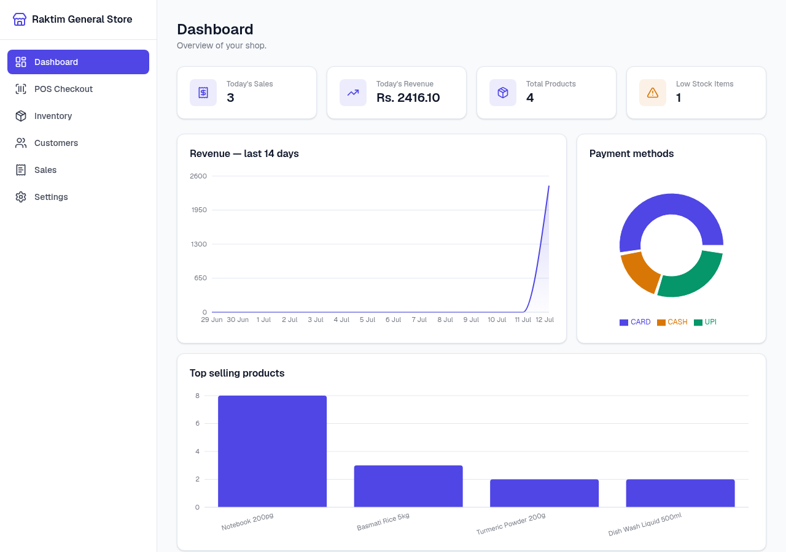
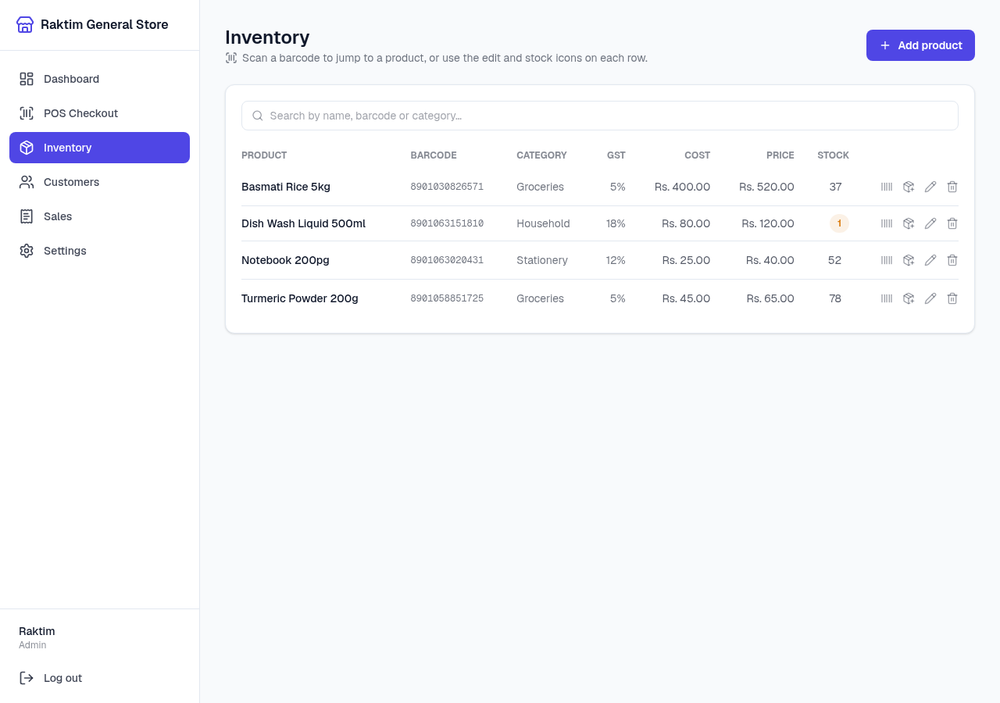
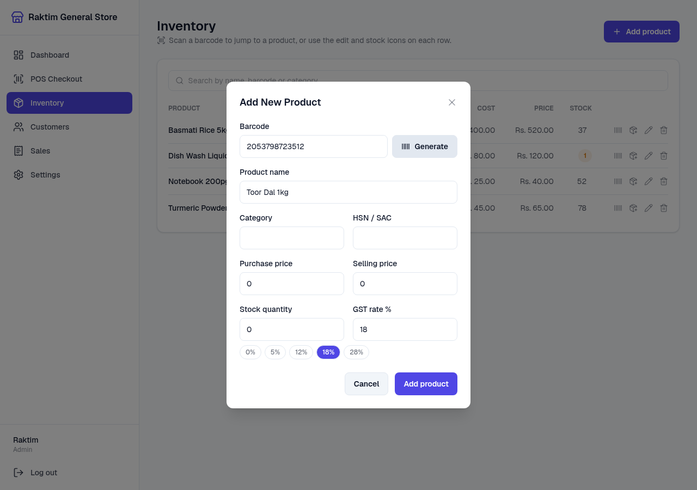
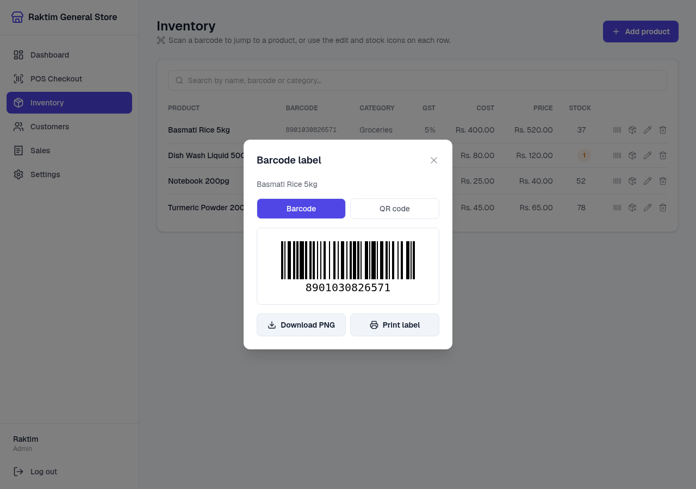
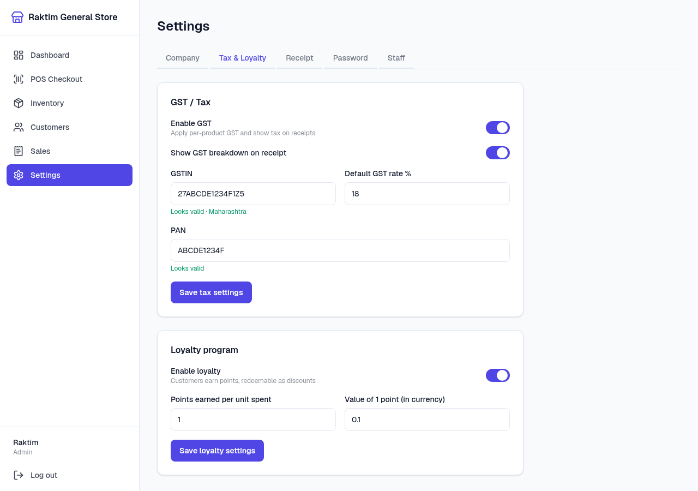

# nodedr-pos

[](LICENSE)
[](docker-compose.yml)
[](backend/Dockerfile)
[](#)

A free, open-source, **fully offline** Point of Sale and inventory management
system for small retail shops. It runs entirely on a local machine via
Docker — no internet connection, no subscription, no cloud dependency, and
no data ever leaves the shop.

Built for a barcode-scanner counter setup: scan an item to sell it, press
Enter to check out, then print or download the receipt with one click. No
barcode? Generate one and print a label, right from the app.

Access it at **`http://<machine>:1994`** — from the shop's own machine or any
tablet/phone on the same network.

## Screenshots

| Dashboard | Inventory |
| --- | --- |
|  |  |

| Generate a barcode for a new product | Print or download a barcode label |
| --- | --- |
|  |  |

| GSTIN / PAN validation |
| --- |
|  |

## Contents

- [Features](#features)
- [Architecture](#architecture)
- [Tech stack](#tech-stack)
- [Quick start](#quick-start)
- [Hardware setup](#hardware-setup)
- [Reference data & validation](#reference-data--validation)
- [Customer dues ("udhaar")](#customer-dues-udhaar)
- [Updating](#updating)
- [Backing up your data](#backing-up-your-data)
- [Resetting / clearing data](#resetting--clearing-data)
- [Project structure](#project-structure)
- [Local development (without Docker)](#local-development-without-docker)
- [API overview](#api-overview)
- [Security](#security)
- [Contributing](#contributing)
- [License](#license)

## Features

- **Guided onboarding** — first launch walks you through creating an admin
  account and configuring your company (name, address, currency, GST,
  loyalty) before you ever see the dashboard.
- **Barcode-driven POS checkout** — scan to add to the cart, scan again to
  bump quantity, press **Enter** to finalize. Unknown barcodes surface a
  toast instead of blocking the register.
- **GST / tax** — per-product GST rates with HSN/SAC codes. The price you
  enter is treated as MRP (GST-inclusive, as required by law) — GST is
  never added on top of it, only broken out as CGST/SGST on the receipt for
  compliance, alongside your GSTIN. Toggle GST on/off in settings.
- **Discounts** — percentage or flat-amount discount per sale (applied
  correctly across mixed tax rates), *and* a standing per-product discount
  % you can set once in Inventory that applies automatically every time
  that product is sold.
- **Loyalty program** — customers (by phone) earn points on every purchase,
  redeemable as a discount at checkout — enter an amount or tap **Use all**.
  Configurable earn rate and point value. The dashboard ranks your top
  customers by current point balance.
- **Customer dues ("udhaar")** — a cash sale can be paid short of the total
  when a customer is attached; the shortfall becomes a running due balance
  you can record payments against later, with a full payment history. See
  [Customer dues](#customer-dues-udhaar).
- **Multi-currency** — over 20 major currencies (₹ INR, $ USD, € EUR, £ GBP,
  and more), switchable in settings; the symbol flows through the whole app
  and onto receipts. One source of truth on the backend
  ([`backend/src/lib/currency.js`](backend/src/lib/currency.js)) so
  onboarding and settings can never drift apart.
- **Offline barcode & QR generator** — no barcode on the product? Generate a
  valid EAN-13 in one click and print or download a label as a PNG or JPG,
  no internet or external barcode service involved. See
  [Barcode & QR label generator](#barcode--qr-label-generator).
- **GST/PAN validation & reference data** — live format validation for GSTIN
  and PAN, GST state-code decoding, quick-select GST rate slabs, and a
  per-product unit (UQC). Optionally import the official HSN/SAC/PIN/IFSC
  CSVs for autocomplete and address/bank lookups. See
  [Reference data & validation](#reference-data--validation).
- **Works on phones and tablets** — the nav collapses to a slide-out drawer
  below desktop width, so the register is fully usable from a counter
  tablet or phone, not just a desktop browser.
- **Customers** — a directory with visit counts, total spend, and loyalty
  balances.
- **Customizable receipts** — set a header and footer; the thermal receipt
  renders your branding, GST breakdown, discounts, and loyalty summary.
- **Multiple payment methods** — Cash (with change calculation), UPI, Card.
- **Staff accounts & roles** — an admin plus any number of cashier logins;
  admins manage staff and settings, cashiers run the register.
- **Sales history** — searchable past invoices with a detail view and
  one-click receipt reprint.
- **Inventory management** — scan a known barcode to edit stock; an unknown
  one opens "Add Product" pre-filled. Low-stock dashboard alerts. An
  "allow negative stock" setting lets you keep selling past zero when your
  counts run behind reality, instead of blocking the register.
- **Print or download receipts** — "Print" opens a formatted receipt in a
  new tab and triggers your browser's own print dialog, so you pick whichever
  printer the OS/CUPS has configured (thermal, laser, or "Save as PDF"); a
  separate "Download PDF" button always generates a real PDF file. Both are
  laid out to use as little paper as possible — the PDF's page height fits
  the specific receipt instead of a fixed size. An "auto-print" setting can
  skip the extra click and send the receipt to print the moment a sale
  completes. See [printing & receipts](#printing--receipts).
- **Sales dashboard with charts** — revenue trend, best seller, top-selling
  products, payment method mix, top loyalty customers, and today's totals
  and low-stock alerts — plus a one-click CSV export of your sales history.
- **Zero external calls at runtime** — once built, the app never talks to
  anything outside your machine.

## Architecture

```
  Browser / LAN tablet
        │  http://<machine>:1994   (the ONLY exposed port)
        ▼
┌──────────────────────┐   /api/* proxied server-side   ┌──────────────────────┐
│   frontend  :1994    │ ──────────────────────────────▶ │  backend (internal)  │
│   Next.js / React     │ ◀────────────────────────────── │  Express + Prisma    │
└──────────────────────┘   (internal Docker network)      └──────────┬───────────┘
                                                                      │
                                                                      ▼
                                                        SQLite (nodedr-pos_data)
                                                        (named Docker volume)
```

Receipts print through the browser's own print dialog (a new tab that calls
`window.print()`) or download as a PDF generated server-side — the backend
never talks to a printer device directly, so no container needs raw
hardware access.

**One port, one origin.** The browser only ever talks to the frontend on
port **1994**. The Next.js server proxies every `/api/*` request to the
backend over the internal Docker network — the backend is **not** published
to the host at all. This means:

- the app works from **any device on the LAN** (a counter tablet, a phone),
  not just the machine running the containers;
- session cookies are first-party, so there's no cross-origin/CORS fragility;
- the API isn't exposed on the network, shrinking the attack surface.

The backend and frontend are two separate containers, neither of which needs
elevated privileges or host device access — everything still comes up with a
single `docker compose up`.

## Tech stack

| Layer      | Choice                                                  |
| ---------- | -------------------------------------------------------- |
| Frontend   | Next.js (App Router), React, TypeScript, Tailwind CSS     |
| Data layer | TanStack Query, react-hook-form + Zod                    |
| Backend    | Node.js, Express, Zod validation, helmet, rate limiting   |
| Database   | SQLite via Prisma ORM (`better-sqlite3` driver adapter), persisted in a Docker volume |
| Auth       | bcrypt hashing, HttpOnly JWT cookie, admin/cashier roles   |
| API access | Browser → Next.js (:1994) → server-side `/api` proxy → backend |
| Hardware   | Browser print dialog + `pdfkit` for receipts; a custom React hook for the barcode scanner |
| Barcodes   | `jsbarcode` (EAN-13/CODE128) + `qrcode`, both rendered client-side to canvas — no external barcode service |
| Charts     | `recharts` for the dashboard's sales trend, top products, and payment mix graphs |
| Bulk import | `multer` (multipart upload) + `csv-parse`, admin-only, for the Reference Data CSV imports |
| Deployment | Docker Compose, two `node:24-alpine` multi-stage images    |

## Quick start

Requires [Docker](https://docs.docker.com/get-docker/) and Docker Compose
(bundled with current Docker Desktop/Engine).

### One-click install

```bash
git clone https://github.com/Raktim94/nodedr-pos.git && cd nodedr-pos && ./install.sh
```

[`install.sh`](install.sh) checks that Docker is installed, builds both
images, starts the stack, waits for the backend to report healthy, then
prints the URL to open. Re-run it any time to rebuild after pulling updates.

### Manual install

If you'd rather run each step yourself (or `install.sh` doesn't fit your
setup), here's exactly what it does, one command at a time:

```bash
# 1. Get the code
git clone https://github.com/Raktim94/nodedr-pos.git
cd nodedr-pos

# 2. Build the backend and frontend images (multi-stage, node:24-alpine).
#    First run takes a few minutes; later runs are cached and fast.
docker compose build

# 3. Start both containers in the background. Compose automatically
#    creates the named volume declared in docker-compose.yml
#    (nodedr-pos_data) the first time this runs.
docker compose up -d

# 4. (optional) Watch the logs until you see "listening on port 4000"
#    and the Next.js server ready message.
docker compose logs -f

# 5. (later) Stop the stack without deleting your data:
docker compose down
```

Then open **http://localhost:1994**. The first launch walks you through:

1. **Admin account** — your name, email, and password.
2. **Shop setup** — shop name, address, currency symbol, low-stock threshold.
3. You're dropped onto the dashboard, ready to add products and sell.

All data (the SQLite database and the auto-generated session secret) lives
in the **`nodedr-pos_data` Docker volume**, not inside the containers, so it
survives `docker compose down`, container recreation, and image rebuilds.
It's only removed if you explicitly delete it (see
[Resetting](#resetting--clearing-data) below).

Want the web UI on a different port? Change the left-hand side of
`"1994:3000"` under the `frontend` service's `ports:` in `docker-compose.yml`,
and update `FRONTEND_ORIGIN` under the `backend` service to match (it's used
for CORS, so the two must agree).

## Hardware setup

### Barcode scanner

No configuration needed. Any USB barcode scanner that acts as a HID
keyboard (i.e. "just types" the barcode followed by Enter — this is true of
the vast majority of consumer scanners) works out of the box. The frontend's
[`useBarcodeScanner`](frontend/hooks/useBarcodeScanner.ts) hook listens for
keystrokes and, based on inter-keystroke timing, tells scanner input apart
from a human typing so it never interferes with normal form fields.

### Barcode & QR label generator

Not every product arrives with a scannable barcode — loose produce, house
brands, or anything repackaged in-store. Rather than force a manual code,
the **Add Product** form has a **Generate** button next to the barcode
field: it produces a structurally valid EAN-13 using the `20`–`29` prefix
range GS1 reserves for restricted/internal circulation — i.e. exactly this
use case, not a real resellable product code (see
[`frontend/lib/barcode.ts`](frontend/lib/barcode.ts)). It's checked against
your existing catalog for uniqueness and retried automatically on collision.

From the Inventory page, the barcode icon on any row opens a label with a
**Barcode** / **QR code** toggle, rendered client-side with `jsbarcode` /
`qrcode` — no network call, works fully offline. From there:

- **Print label** opens a new tab and calls `window.print()`, same as
  receipts — any printer your OS/CUPS knows about, including small label
  printers.
- **Download PNG or JPG** saves the rendered code as an image — pick the
  format with the radio buttons above the download button.

### Printing & receipts

nodedr-pos doesn't talk to a printer device directly — no raw USB, no bundled
driver, no `privileged: true` container. Instead, after checkout (or from the
Sales page on any past invoice), you get two buttons:

- **Print** opens a formatted receipt in a new browser tab and immediately
  triggers `window.print()`. The browser's own print dialog shows every
  printer your OS knows about — a USB/network thermal printer set up through
  CUPS (Linux/macOS) or the Windows print spooler, a regular office printer,
  or a "Save as PDF" virtual printer. Set up your thermal printer once at the
  OS level (CUPS, or the manufacturer's driver) the same way you would for
  any other application, and it shows up here.
- **Download PDF** generates a real PDF file server-side (via `pdfkit`, a
  pure-JS renderer — no shell-out, no native dependencies) and downloads it,
  for emailing, archiving, or printing later from any device.

Turn on **Settings → Receipt → Print automatically after every sale** to
skip the extra click entirely — the receipt opens and sends to your
printer the moment checkout completes.

Both layouts are kept deliberately tight, since every extra millimetre of
whitespace is real, recurring thermal paper cost: the HTML receipt's CSS
has no unnecessary paragraph margins, and the PDF's page height is
computed per-receipt (short receipts get a short page) instead of a fixed
size — a one-item receipt is roughly half the page length it used to be.

Because printing is just a normal browser action, the whole app — including
checkout — works identically on a machine with no printer attached at all;
you'd simply skip the Print button and use Download PDF, or nothing.

### Receipt layout

Both the print view and the PDF share the same data: shop header/footer,
GST/CGST/SGST breakdown, discount, and loyalty summary, driven by your
settings. The HTML template lives in
[`backend/src/lib/receipt.js`](backend/src/lib/receipt.js) (`buildReceiptHtml`)
and the PDF renderer in [`backend/src/lib/pdf.js`](backend/src/lib/pdf.js)
(`buildReceiptPdf`).

```
================================================
                  Raktim Store
                   1 MG Road
                    Pune, MH
             GSTIN: 27ABCDE1234F1Z5
================================================
Date: 11-07-2026 18:06     Bill: #INV-2026-00002
Cust: Rahul
Ph:   9990001111
------------------------------------------------
Item                      Qty     Rate    Amount
------------------------------------------------
Biscuits                    1   118.00    118.00
  GST @ 18%
------------------------------------------------
Subtotal                              Rs. 118.00
CGST (incl.)                            Rs. 9.00
SGST (incl.)                            Rs. 9.00
Loyalty (100 pts)                     Rs. -10.00
================================================
GRAND TOTAL                           Rs. 108.00
================================================
Paid (UPI)                            Rs. 108.00
------------------------------------------------
         You earned 108 loyalty points!
================================================
            Thank You! Visit Again.
================================================
```

The "Rate" you enter on a product is its MRP — GST-inclusive, as required
by law — so CGST/SGST are a breakup of tax already inside that price, not
an addition to it: Subtotal is the MRP total, and GRAND TOTAL is Subtotal
minus discounts, full stop.

The header, footer, currency, GSTIN, and whether the GST breakdown shows are
all driven by your settings, so this layout adapts to how you configure the
shop.

## Reference data & validation

### Built-in (small, stable lists)

[`frontend/lib/masters.ts`](frontend/lib/masters.ts) bundles small, stable
reference data used across the app's forms:

| Data | Used for |
| --- | --- |
| `GST_RATES` | Quick-select chips (0/5/12/18/28%) on the product GST rate field |
| `GST_STATE_CODES` | Decoding a GSTIN's first two digits to a state name in Settings |
| `UQC_UNITS` | The Unit dropdown on each product (KGS, PCS, BOX, …) — see [below](#product-units-uqc) |
| `BUSINESS_TYPES` | Common Indian business registration types |
| `GENERIC_PRODUCT_CATEGORIES` | Datalist suggestions on the product Category field (plus whatever categories are already in your catalog) |
| `isValidGstinFormat` / `isValidPanFormat` | Live, non-blocking format hints on the GSTIN/PAN fields in Settings |

These are **structural/format checks only** (regex, not the GSTIN checksum
digit algorithm) — deliberately advisory rather than hard validation, so a
real GSTIN/PAN is never rejected by a subtly wrong client-side rule.

### Bulk data (admin-imported CSV)

Full HSN/SAC code catalogs (tens of thousands of entries), PIN codes, and
IFSC codes are **deliberately not bundled** — these are large, frequently-
revised government/RBI datasets, and shipping a fixed snapshot in an
offline app would go stale and risks being silently wrong on real tax
filings or bank transfers.

Instead, **Settings → Reference Data** (admin only) lets you import a CSV
of the current official file yourself, at any time:

| Dataset | CSV columns | Official source |
| --- | --- | --- |
| HSN codes | `code, description, gstRate` (rate optional) | CBIC HSN directory |
| SAC codes | `code, description, gstRate` (rate optional) | CBIC SAC directory |
| PIN codes | `pincode, area, district, state` | India Post / data.gov.in |
| IFSC codes | `ifsc, bank, branch, address, district, state` | RBI IFSC directory |

Each import **replaces** the existing rows for that dataset — re-importing
an updated file is always safe, there's no incremental merge to reason
about. Once loaded:

- The product **HSN/SAC field** autocompletes against the imported tax codes.
- **Company settings** gets a PIN-code lookup that autofills city/state.
- **Reference Data** also has a standalone IFSC search box, for looking up
  a bank/branch by code without it being tied to any other field.

Nothing here is required — the app works fully without ever visiting this
tab; it only adds autocomplete/autofill convenience once you've loaded data.

### Product units (UQC)

Each product has an optional **Unit** (e.g. `KGS`, `PCS`, `BOX`, from the
standard GST Unit Quantity Codes). It's snapshotted onto each invoice line
at sale time — same pattern as `name`/`taxRate` — so it shows on receipts
("3 KGS") and doesn't change retroactively if you edit the product later.

## Customer dues ("udhaar")

A cash sale can be finalized with **Amount received** less than the total
whenever a customer (with a phone number) is attached — the shortfall is
added to that customer's running due balance instead of blocking the sale.
The POS warns you before checkout if a looked-up customer already has an
outstanding due, and again if the current sale will add to it.

Record a payment against a due from the **Customers** page — click the due
amount next to any customer to open a small form; it's capped at their
current balance and kept as its own history (`CustomerDuePayment`) rather
than just decrementing a number, so there's an audit trail of who paid
what and when.

## Updating

To pull the latest code and redeploy:

```bash
# 1. Get the latest commits. Run this from inside your nodedr-pos
#    directory — if you're not already there, cd into it first:
#    cd nodedr-pos
git pull

# 2. Rebuild the images and recreate the containers with the new code.
#    Re-running install.sh does exactly this too.
docker compose up -d --build
```

Your data is safe across updates — the SQLite database and session secret
live in the `nodedr-pos_data` Docker volume, entirely separate from the
container filesystem, so rebuilding or recreating containers never touches
them. Run `docker volume ls` to see it.

## Backing up your data

The database lives inside a Docker-managed volume rather than a plain host
folder, so back it up via a throwaway container that mounts the volume
read-only and copies the file out:

```bash
docker run --rm -v nodedr-pos_data:/data:ro -v "$PWD":/backup alpine \
  cp /data/pos.db /backup/pos-backup-$(date +%Y%m%d).db
```

That drops a timestamped copy of `pos.db` in your current directory on the
host.

## Resetting / clearing data

To wipe everything (admin account, shop settings, products, invoices) and
go through onboarding again — useful after testing, or to start a real shop
from a clean slate:

```bash
# 1. Stop the stack AND remove the named volume (the -v is what deletes
#    the database and session secret; without it, `down` only removes
#    the containers and your data is untouched).
docker compose down -v

# 2. Start back up — a fresh volume is created automatically and
#    you'll land on the onboarding wizard again.
docker compose up -d
```

To remove the volume without also touching the containers:
`docker volume rm nodedr-pos_data` (stack must be stopped first).

If you only want to clear the *catalog and sales history* but keep your
admin login and shop settings, don't delete the files — instead delete
products/invoices from inside the app (Inventory page), since there's no
current admin-account-preserving "factory reset" endpoint.

## Project structure

```
nodedr-pos/
├── docker-compose.yml         # declares the nodedr-pos_data named volume
├── docs/screenshots/          # README images
├── backend/
│   ├── Dockerfile
│   ├── prisma/schema.prisma  # User, ShopSettings, Product, Invoice, InvoiceItem
│   └── src/
│       ├── server.js
│       ├── routes/           # auth, settings, products, invoices, print
│       ├── middleware/auth.js
│       └── lib/              # prisma client, JWT secret, currencies, receipt HTML + PDF rendering
└── frontend/
    ├── Dockerfile
    ├── next.config.ts        # /api → backend proxy (rewrites)
    ├── app/
    │   ├── onboarding/, login/                         # unauthenticated flows
    │   └── (app)/dashboard, pos, inventory, customers, sales, settings
    ├── components/           # AppShell, ProductModal, BarcodeLabelModal, SalesCharts, ReceiptActions, ui/*
    ├── lib/                  # api client, format helpers, barcode.ts, masters.ts (reference data)
    └── hooks/                # useBarcodeScanner, useProducts, useCustomers, useInvoices, useAuth, useShopSettings
```

## Local development (without Docker)

Run the backend and frontend in two terminals.

```bash
# Terminal 1 — backend on :4000
cd backend
cp .env.example .env
npm install
npm run prisma:migrate:dev
npm run dev

# Terminal 2 — frontend on :1994 (proxies /api to the backend)
cd frontend
npm install
BACKEND_URL=http://localhost:4000 npm run dev
```

Open `http://localhost:1994`. The browser only talks to :1994; the Next.js
dev server proxies `/api/*` to `BACKEND_URL` (default `http://localhost:4000`).
No API URL is ever baked into the browser bundle.

## API overview

All endpoints are under `/api` and reached through the frontend proxy at
`http://<machine>:1994/api`. Except `/auth/status`, `/auth/login`,
`/auth/register`, and the one-time `POST /settings`, every route requires the
`nodedr_session` cookie; admin-only routes also require the `admin` role.

| Method & path                  | Purpose                                  |
| ------------------------------- | ----------------------------------------- |
| `GET /auth/status`              | Whether an admin account exists yet       |
| `POST /auth/register`           | Onboarding — create the first admin (once) |
| `POST /auth/login` / `/logout`  | Session management                        |
| `POST /auth/change-password`    | Change your own password                  |
| `GET/POST/PUT /auth/users`      | Staff account management (**admin only**) |
| `GET/POST/PUT /settings`        | Company/currency/GST/loyalty/receipt config (PUT is **admin only**) |
| `GET/POST/PUT/DELETE /products` | Catalog CRUD, `+/barcode/:code`, `/low-stock` |
| `GET/POST/PUT /customers`       | Customer directory, `+/phone/:phone` lookup, `+/top-loyalty` ranking |
| `POST /customers/:id/settle-due`, `GET /customers/:id/due-payments` | Record / list payments against a customer's due balance |
| `POST /invoices`                | Finalize a sale — server computes price, tax, discount, loyalty, due; decrements stock; all transactional |
| `GET /invoices`, `/invoices/summary`, `/invoices/:id` | Sales history & dashboard totals |
| `GET /invoices/analytics`       | Dashboard chart data — revenue trend, top products, payment mix |
| `GET /invoices/export.csv`      | Downloads sales history as CSV (optional `?from=&to=` range) |
| `GET /print/:invoiceId/receipt` | Self-printing HTML receipt (opens in a new tab, calls `window.print()`) |
| `GET /print/:invoiceId/pdf`     | Downloads the receipt as a PDF file |
| `GET /masters/summary`          | Row counts for the Reference Data settings tab |
| `POST /masters/tax-codes/import`, `GET /masters/tax-codes/search` | Import (**admin only**) / autocomplete HSN or SAC codes |
| `POST /masters/pincodes/import`, `GET /masters/pincodes/:code` | Import (**admin only**) / look up a PIN code |
| `POST /masters/ifsc/import`, `GET /masters/ifsc/:code` | Import (**admin only**) / look up an IFSC code |

## Security

Security posture (verified end-to-end):

- **Passwords**: bcrypt (cost 12); login is timing-uniform and returns an
  identical error for unknown-user vs wrong-password. Login is rate-limited
  (10 / 15 min) on top of a global limiter (300 req/min).
- **Sessions**: `HttpOnly`, `SameSite=Lax` JWT cookie (`HS256`, algorithm
  pinned). Every request re-checks the account still exists and is active, so
  disabling a staff member logs them out immediately. Set `COOKIE_SECURE=true`
  when serving over HTTPS.
- **Authorization**: all data routes require auth; settings and staff
  management require the `admin` role. The last active admin can't be demoted
  or disabled.
- **Server-authoritative money**: prices, tax, discount caps, loyalty value,
  and change are always computed server-side from the catalog and settings —
  the client only sends product ids, quantities, and intent, so a tampered
  request can't alter what a sale charges. Redeemable points are capped at the
  customer's balance.
- **Input validation**: every write endpoint validates with Zod (allowlisted
  fields — no mass assignment); all DB access is parameterized via Prisma.
  CSV imports are admin-only, capped at 25MB, and parsed in-memory (no
  temp files, no shell-out).
- **Reduced surface**: the backend is not published to the host — only the
  frontend (:1994) is reachable, and it proxies to the backend privately.
  Helmet sets `X-Content-Type-Options`, `X-Frame-Options`, etc. Neither
  container runs `privileged: true` or needs host device access — printing
  goes through the browser's own print dialog, not a driver bundled into the
  app.
- **Secrets**: the JWT signing secret is auto-generated on first boot and
  stored (mode 600) in the data volume — never in the repo.

Designed for a **trusted local network** (a shop's LAN or a single machine).
It's HTTP by default; if you expose it beyond the counter, terminate HTTPS in
front of it and set `COOKIE_SECURE=true`.

## Contributing

Issues and PRs are welcome. This is a small, focused tool — please keep
contributions aligned with "offline-first single-shop POS" rather than
expanding scope into multi-tenant/cloud territory.

## License

[MIT](LICENSE)
